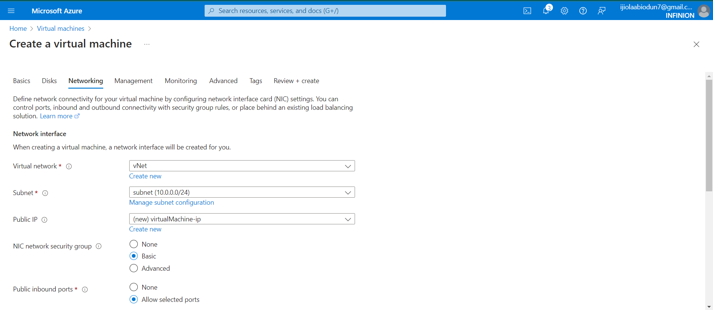
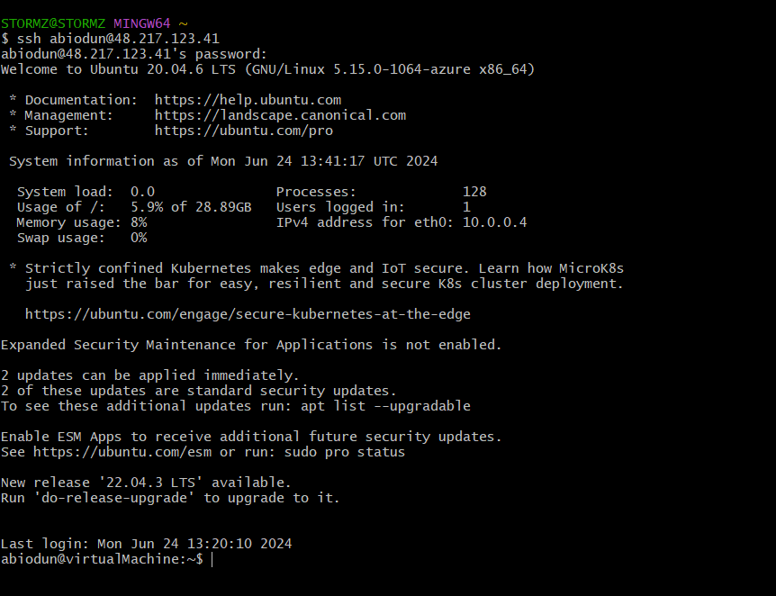
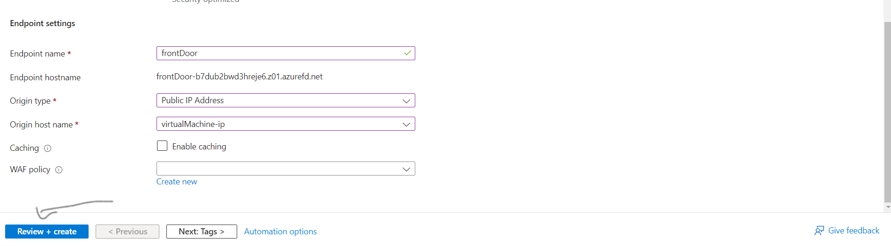

<h2 text-align='center'> Graduate Trainee Assessment at Infinion Technologies ( Cloud/ Devops )<h2>

<h3 text-align='center'> Prerequisites<h3>
The following prerequisites are required for the Graduate Trainee Assessment by Infenion Technologies

1. Complete the AZ-900t00 and show an evidence of completion.

2. Watch all the Infinion ramp-up playlist.

3. Complete task 3.

4. An Azure account with subscription

<h3 text-align='center'>Task 3 pictorial display<h3>
The following pictorially steps are followed for the completion of task 3:

<h3 text-align='center'>Thank you very much<h3>